<picture>
  <source media="(prefers-color-scheme: dark) and (max-width: 600px)" srcset="./assets/hero-es-dark-mobile-fc.svg">
  <source media="(prefers-color-scheme: light) and (max-width: 600px)" srcset="./assets/hero-es-light-mobile-fc.svg">
  <source media="(prefers-color-scheme: dark)" srcset="./assets/hero-es-dark-fc.svg">
  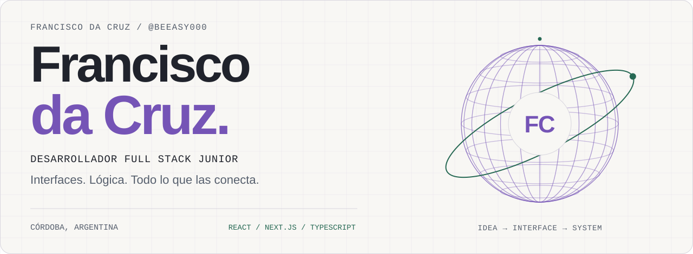
</picture>

<a href="./README.md">Read in English</a>

  
  
  

### De la interfaz a los datos que la hacen funcionar.

Soy **Francisco**, desarrollador full stack junior y estudiante de **Ingeniería en Sistemas de Información en la Universidad Tecnológica Nacional, Facultad Regional Córdoba**.

Desarrollo aplicaciones web con **React, Next.js y TypeScript**, y utilizo **Supabase y PostgreSQL** para autenticación, almacenamiento y datos. Mis proyectos propios incluyen recorridos interactivos 360°, aplicaciones de comercio y herramientas de análisis de logs en Python.

**Actualmente:** desarrollo DCRZ Studio, continúo la carrera y busco una oportunidad como desarrollador junior.

## Proyectos destacados

<table>
  <tr>
    <td width="50%" valign="top">
      <a href="https://dcrzstudio.com">
        <picture>
          <source media="(prefers-color-scheme: dark)" srcset="./assets/project-dcrz-dark.svg">
          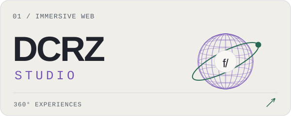
        </picture>
      </a>
      <h3>DCRZ Studio</h3>
      
Recorridos inmobiliarios 360° con navegación entre escenas y puntos interactivos. Incluye gestión de escenas, autenticación y almacenamiento de imágenes.

      
<code>Next.js</code> <code>React</code> <code>Supabase</code> <code>PostgreSQL</code>

      
<a href="https://dcrzstudio.com"><strong>Ver el proyecto ↗</strong></a>

    </td>
    <td width="50%" valign="top">
      <a href="https://lavelizia.com">
        <picture>
          <source media="(prefers-color-scheme: dark)" srcset="./assets/project-velizia-dark.svg">
          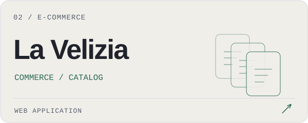
        </picture>
      </a>
      <h3>La Velizia</h3>
      
Tienda de mates y bombillas con catálogos minorista y mayorista, búsqueda, filtros, carrito y solicitudes de pedido por WhatsApp.

      
<code>Next.js</code> <code>React</code> <code>TypeScript</code> <code>Tailwind CSS</code>

      
<a href="https://lavelizia.com"><strong>Ver el proyecto ↗</strong></a>

    </td>
  </tr>
  <tr>
    <td width="50%" valign="top">
      <a href="https://github.com/BeEasy000/ladistri">
        <picture>
          <source media="(prefers-color-scheme: dark)" srcset="./assets/project-distri-dark.svg">
          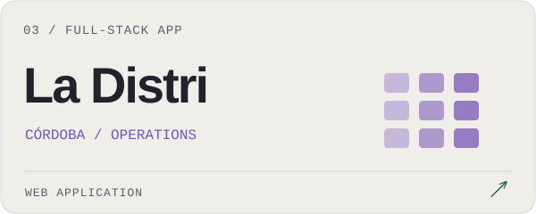
        </picture>
      </a>
      <h3>La Distri Córdoba</h3>
      
Aplicación de comercio y operaciones con retiro por sucursal, carrito persistente y acceso por roles. Validación de pedidos en el servidor, reservas de inventario y protección contra pedidos duplicados.

      
<code>Next.js</code> <code>TypeScript</code> <code>PostgreSQL</code> <code>Supabase</code>

      
<a href="https://github.com/BeEasy000/ladistri"><strong>Ver el código ↗</strong></a>

    </td>
    <td width="50%" valign="top">
      <a href="https://github.com/BeEasy000/python-log-analyzer">
        <picture>
          <source media="(prefers-color-scheme: dark)" srcset="./assets/project-python-dark.svg">
          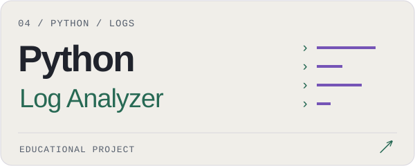
        </picture>
      </a>
      <h3>Python Log Analyzer</h3>
      
Herramienta educativa por consola que procesa eventos JSON Lines, identifica intentos de acceso fallidos repetidos y exporta resúmenes JSON. Utiliza logs ficticios.

      
<code>Python</code> <code>JSON / JSONL</code> <code>CLI</code>

      
<a href="https://github.com/BeEasy000/python-log-analyzer"><strong>Ver el código ↗</strong></a>

    </td>
  </tr>
</table>

## Herramientas con las que trabajo

  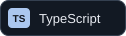
  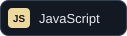
  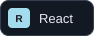
  
  

  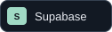
  
  
  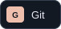
  

**Frontend:** interfaces adaptables a móviles, HTML, CSS y desarrollo con componentes.  
**Backend y datos:** autenticación, APIs HTTP, SQL, almacenamiento de archivos y validación en el servidor.  
**También estoy explorando:** seguridad de aplicaciones, control de acceso y análisis defensivo de logs.

## Un poco más sobre mí

- Estudio **Ingeniería en Sistemas de Información** en la UTN, Córdoba.
- Me interesa entender cómo funciona un producto útil, desde la pantalla hasta la base de datos.
- Desarrollo experiencia práctica mediante proyectos propios y estudio continuo.
- Vivo en **Córdoba, Argentina**. Español · Inglés básico.

### ¿Tenés un proyecto o una oportunidad junior?

Me gustaría conversar sobre lo que estoy construyendo y cómo puedo aportar.

**[franciscodacruz868@gmail.com](mailto:franciscodacruz868@gmail.com)** · **[DCRZ Studio](https://dcrzstudio.com)**

<picture>
  <source media="(prefers-color-scheme: dark)" srcset="./assets/footer-dark.svg">
  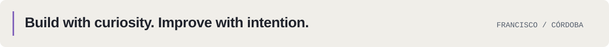
</picture>
