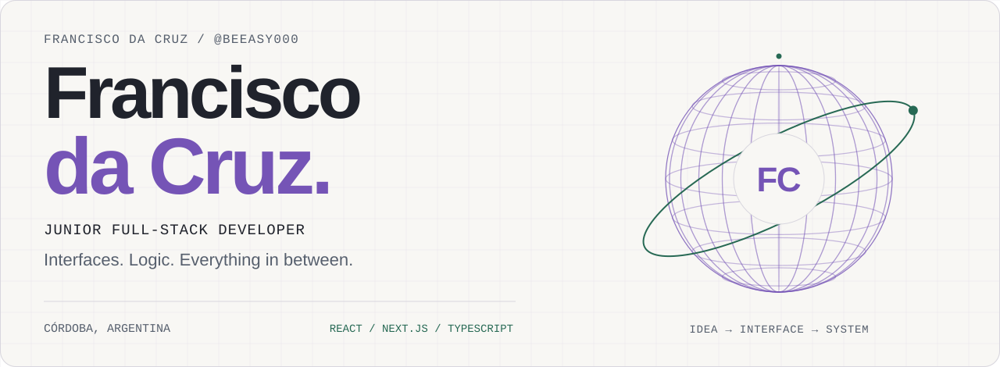
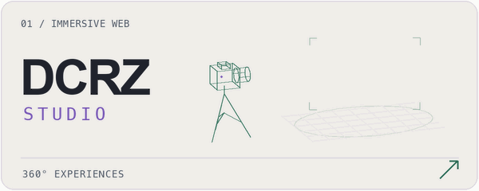

<picture>
  <source media="(prefers-color-scheme: dark) and (max-width: 600px)" srcset="./assets/hero-en-dark-mobile-fc.svg">
  <source media="(prefers-color-scheme: light) and (max-width: 600px)" srcset="./assets/hero-en-light-mobile-fc.svg">
  <source media="(prefers-color-scheme: dark)" srcset="./assets/hero-en-dark-fc.svg">
  
</picture>

<a href="./README.es.md">Leer en español</a>

  
  
  

### From the interface to the data behind it.

I'm **Francisco**, a full-stack developer and Information Systems Engineering student at **Universidad Tecnológica Nacional, Facultad Regional Córdoba**.

I build web applications with **React, Next.js and TypeScript**, working with **Supabase and PostgreSQL** for authentication, storage and data. My personal projects range from interactive 360° tours to commerce applications and Python tools for log analysis.

**Currently:** building DCRZ Studio, continuing my degree and looking for a development role.

## Selected work

<table>
  <tr>
    <td width="50%" valign="top">
      <a href="https://dcrzstudio.com">
        <picture>
          <source media="(prefers-reduced-motion: reduce) and (prefers-color-scheme: dark)" srcset="./assets/project-dcrz-dark-still.png">
          <source media="(prefers-reduced-motion: reduce)" srcset="./assets/project-dcrz-light-still.png">
          <source media="(prefers-color-scheme: dark)" srcset="./assets/project-dcrz-dark.gif">
          
        </picture>
      </a>
      <h3>DCRZ Studio</h3>
      
Interactive 360° property tours with scene navigation and hotspots. Includes scene management, authentication and image storage.

      
<code>Next.js</code> <code>React</code> <code>Supabase</code> <code>PostgreSQL</code>

      
<a href="https://dcrzstudio.com"><strong>Explore the project ↗</strong></a>

    </td>
    <td width="50%" valign="top">
      <a href="https://lavelizia.com">
        <picture>
          <source media="(prefers-color-scheme: dark)" srcset="./assets/project-velizia-dark.svg">
          
        </picture>
      </a>
      <h3>La Velizia</h3>
      
A storefront for mate cups and drinking straws, with retail and wholesale catalogs, search, filters, a cart and order requests through WhatsApp.

      
<code>Next.js</code> <code>React</code> <code>TypeScript</code> <code>Tailwind CSS</code>

      
<a href="https://lavelizia.com"><strong>Explore the project ↗</strong></a>

    </td>
  </tr>
  <tr>
    <td width="50%" valign="top">
      <a href="https://github.com/BeEasy000/ladistri">
        <picture>
          <source media="(prefers-color-scheme: dark)" srcset="./assets/project-distri-dark.svg">
          
        </picture>
      </a>
      <h3>La Distri Córdoba</h3>
      
Commerce and operations app with branch pickup, a persistent cart and role-based access. Server-side order validation, inventory reservations and protection against duplicate orders.

      
<code>Next.js</code> <code>TypeScript</code> <code>PostgreSQL</code> <code>Supabase</code>

      
<a href="https://github.com/BeEasy000/ladistri"><strong>Read the code ↗</strong></a>

    </td>
    <td width="50%" valign="top">
      <a href="https://github.com/BeEasy000/python-log-analyzer">
        <picture>
          <source media="(prefers-color-scheme: dark)" srcset="./assets/project-python-dark.svg">
          
        </picture>
      </a>
      <h3>Python Log Analyzer</h3>
      
An educational command-line tool that parses JSON Lines events, identifies repeated failed access attempts and exports JSON summaries. Uses synthetic logs.

      
<code>Python</code> <code>JSON / JSONL</code> <code>CLI</code>

      
<a href="https://github.com/BeEasy000/python-log-analyzer"><strong>Read the code ↗</strong></a>

    </td>
  </tr>
</table>

## Tools I work with

  
  
  
  
  

  
  
  
  
  

**Frontend:** responsive interfaces, HTML, CSS and component-based development.  
**Backend & data:** authentication, HTTP APIs, SQL, file storage and server-side validation.  
**Also exploring:** application security, access control and defensive log analysis.

## A little more about me

- Studying **Information Systems Engineering** at UTN, Córdoba.
- Interested in how useful products work, from the screen to the database.
- Building practical experience through my own projects and continued study.
- Based in **Córdoba, Argentina**. Spanish · English (basic).

### Have a project or a junior role in mind?

I'd be happy to talk about what I'm building and what I can contribute.

**[franciscodacruz868@gmail.com](mailto:franciscodacruz868@gmail.com)** · **[DCRZ Studio](https://dcrzstudio.com)**

<picture>
  <source media="(prefers-color-scheme: dark)" srcset="./assets/footer-dark.svg">
  
</picture>
